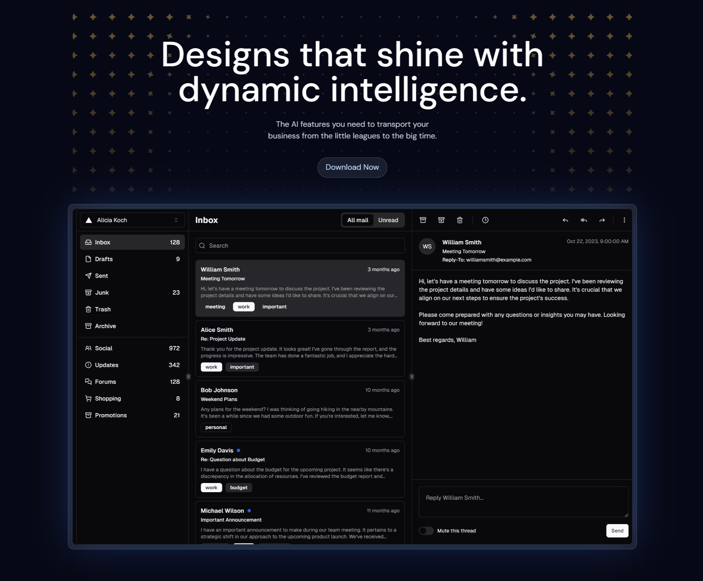

## <!--  -->

# Glisten AI Remade 🌐

&nbsp;&nbsp;

&nbsp;&nbsp;

&nbsp;&nbsp;

#### Demo Glisten AI homepage remade based on a tutorial using Prismic, React, Next.js, Tailwind CSS, and GSAP.

### Visit Us: [https://glisten-ai-remade.vercel.app/](https://glisten-ai-remade.vercel.app/)

---

  

---

- [x] Module setup
- [x] Tailwind config
- [x] Header
- [x] Footer
- [x] Hero Section
- [x] Bento Section
- [x] Showcase Section
- [x] Case Study Section
- [x] Case Study pages (Nike/Prismic)
- [x] Integration Section
- [x] Call To Action Section
- [x] Mobile NavBar
- [x] Hero section animations
- [x] StartGrid animations
- [x] Showcase section animations
- [x] Integrations section animations
- [x] Testing and deployment

---

